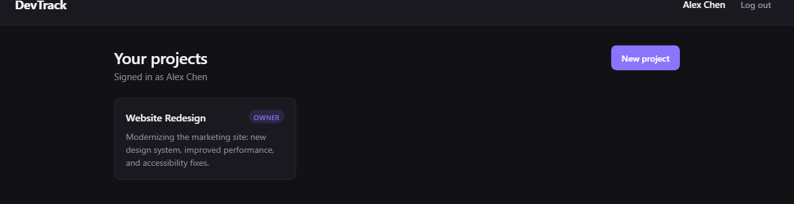
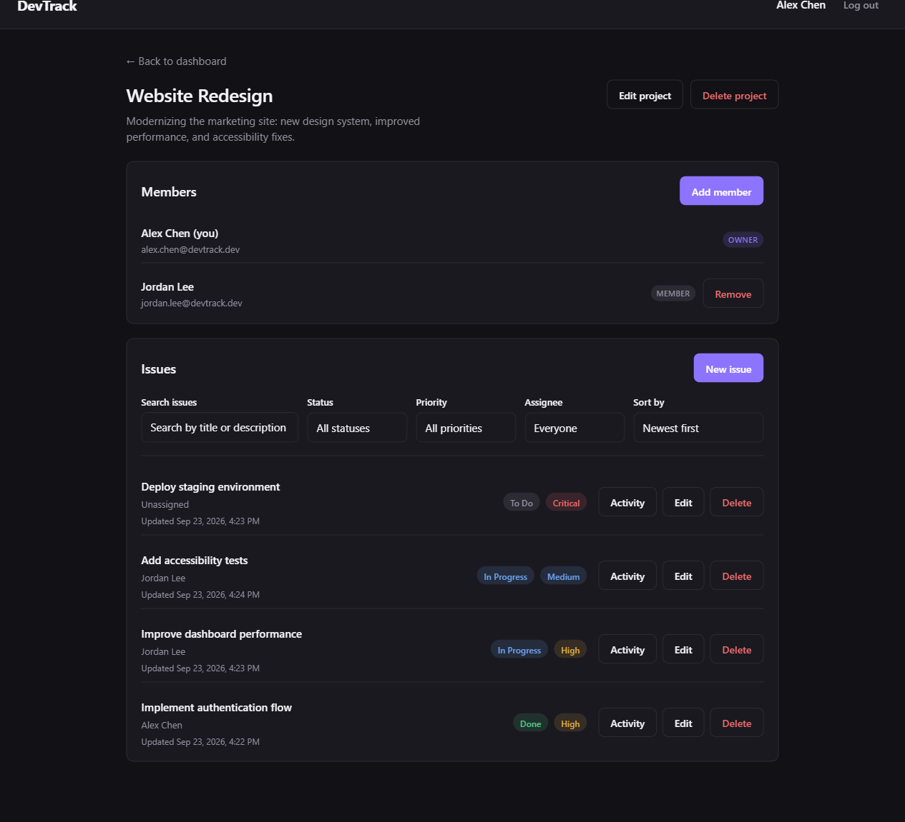
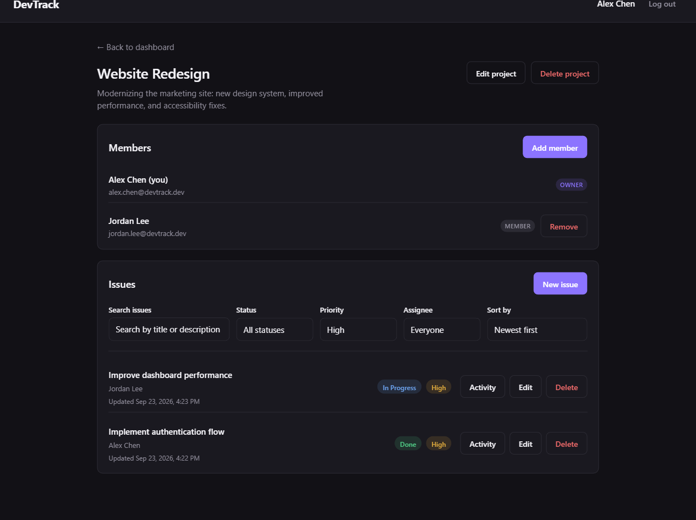
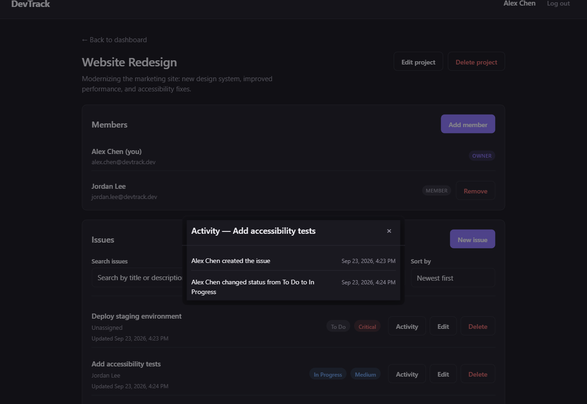
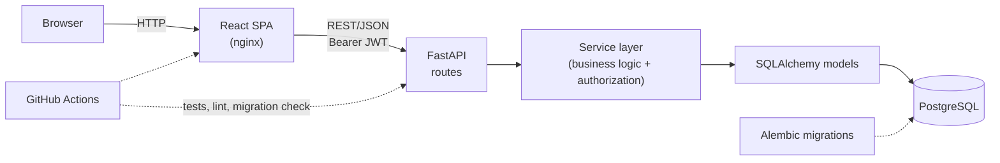

# DevTrack

A production-style full-stack project and issue tracking platform, built with React, FastAPI,
PostgreSQL, Docker, and GitHub Actions — in the spirit of tools like Jira or Linear, scoped down
to a focused, portfolio-quality slice of that problem.

You can register, log in, create projects, manage project members, and create/edit/assign/delete
issues entirely through the web UI, backed by a JWT-authenticated REST API with every
authorization rule enforced server-side. Issues can be searched, filtered, and sorted, and each
issue keeps a lightweight activity history. The full stack runs in Docker, migrations are
verified against real PostgreSQL, and CI runs on every push/PR.

## Demo / Screenshots

| | |
|---|---|
| **Dashboard** | **Project detail** |
|  |  |
| **Issue filtering** | **Issue activity history** |
|  |  |

All screenshots use seeded demo data, not real user information.

## Features

- Email/password registration and login, with JWT bearer-token authentication
- Create, view, update, and delete projects
- Add and remove project members, with owner-only controls enforced server-side
- Create, edit, assign, and delete issues, with status (`todo`/`in_progress`/`done`) and priority
  (`low`/`medium`/`high`/`critical`)
- Client-side search, status/priority/assignee filtering, and sorting over a project's issues
- Per-issue activity history (creation, and status/priority/assignee/title/description changes)
- Keyboard-accessible confirmation dialogs for destructive actions (delete issue, delete project)
- `/health` and `/ready` endpoints for container/orchestrator liveness and readiness checks

## Architecture

```
DevTrack/
├── backend/              FastAPI application (REST API, database access, business logic)
│   ├── Dockerfile        Production image (plain uvicorn, non-root user)
│   └── alembic/          Migrations
├── frontend/             React single-page application
│   ├── Dockerfile        Production image (Vite build → static files served by nginx)
│   └── nginx.conf        SPA routing fallback + static asset caching
├── docs/                 Architecture, API, and development documentation
├── .github/workflows/    CI (backend, frontend, migrations-against-Postgres jobs)
├── docker-compose.yml    Full local stack: postgres + backend + frontend
└── render.yaml           Deployment blueprint (prepared, not yet applied — see Deployment)
```



The backend follows a layered structure to keep concerns separated: `app/api/` (route handlers,
HTTP concerns only) → `app/services/` (business logic and authorization) → `app/models/`
(SQLAlchemy ORM). `app/schemas/` (Pydantic request/response validation) is kept distinct from the
ORM models so what's stored and what's exposed over the API can evolve independently.
Configuration is environment-variable-driven on both sides; no secrets are committed to the
repository.

Full diagrams (including the authentication sequence and database ER model) and more detail live
in [docs/architecture.md](docs/architecture.md).

## Tech Stack

**Frontend** — React, TypeScript, Vite, React Router, Vitest + Testing Library

**Backend** — Python, FastAPI, SQLAlchemy 2.0, Alembic, Pydantic v2, `pyjwt`, `pwdlib` (Argon2)

**Database** — PostgreSQL (SQLite for fast backend unit tests)

**Infrastructure** — Docker / Docker Compose, GitHub Actions CI (backend, frontend, and
Postgres-migration jobs)

**Code quality** — Ruff (backend), ESLint + Prettier (frontend)

## Engineering Highlights

- **Server-side authorization, always** — the frontend hides controls a user can't use, but every
  rule (project ownership, project membership) is re-checked in the service layer regardless of
  what the client sends.
- **Identity derived from the JWT, never from the client** — a project's `owner_id` and an
  issue's `created_by_id`/activity `actor_id` are always resolved from the authenticated user;
  the request schemas for creating a project or issue don't even have those fields.
- **Argon2id password hashing** via `pwdlib`, with hashes never included in any API response
  schema.
- **Layered service architecture** — thin route handlers, a service layer that owns business
  logic and authorization, and a small custom exception hierarchy (`NotFoundError`,
  `ConflictError`, `ValidationError`, `AuthenticationError`, `AuthorizationError`) translated to
  HTTP responses centrally, so route handlers stay free of manual status-code logic.
- **A real Alembic migration chain**, exercised in CI as `upgrade head` → `downgrade base` →
  `upgrade head` against an actual PostgreSQL service container, proving the chain both applies
  and fully reverses — not just that it applies once.
- **Two-tier backend testing** — fast SQLite-backed unit tests for everyday development, plus a
  dedicated integration test that runs the real service layer (ORM + Argon2 hashing) against
  actual PostgreSQL in CI.
- **Migrations as an explicit, separate step** — never run automatically on app or container
  startup, both locally (`docker compose run --rm migrate`) and as documented policy for any real
  deployment, so a migration failure is visible and attributable and concurrent replicas never
  race each other applying it.
- **Multi-stage, non-root Docker builds** — the backend image runs as a non-root `appuser` with
  plain `uvicorn` (no `--reload` in production); the frontend is a Vite build with no Node or dev
  server in the final image, served by nginx.
- **Deliberately scoped issue activity log** — append-only per-issue history that records
  description changes as an event without storing the actual before/after text, avoiding
  large/sensitive free-form content in a permanent log; entries survive the deletion of the user
  who authored them (kept with a null actor rather than deleted or blocking the deletion).
- **Accessible destructive-action UX** — a shared confirmation dialog (not the browser's native
  `confirm()`) with a focus trap, restored focus on close, and a default focus on Cancel rather
  than the destructive action.

## API Overview

The REST API lives under `/api` (health checks excepted) and requires a JWT bearer token on every
endpoint except registration, login, and the two health checks.

| Group | Prefix | Notes |
|---|---|---|
| Health | `/health`, `/ready` | Liveness vs. DB-readiness. |
| Auth | `/api/auth` | Register, login, current-user lookup. |
| Users | `/api/users` | List/view users; self-service update/delete. |
| Projects | `/api/projects` | Create/list/view/update/delete; scoped to owner or members. |
| Memberships | `/api/projects/{id}/members` | List/add/remove members; add/remove is owner-only. |
| Issues | `/api/projects/{id}/issues`, `/api/issues/{id}` | Full CRUD plus per-issue activity history. |

Full route-by-route detail, auth requirements, and status codes are in
[docs/api.md](docs/api.md). For the complete request/response schema of every endpoint, run the
backend and open the interactive OpenAPI docs at **`/docs`**.

## Local Development

Prerequisites: Python 3.12+, Node.js 22+, Docker Desktop (for PostgreSQL, and optionally the full
containerized stack).

```bash
# 1. Environment
cp .env.example .env

# 2. PostgreSQL (in Docker)
docker compose up -d postgres

# 3. Backend
cd backend
python -m venv venv
venv\Scripts\activate            # source venv/bin/activate on macOS/Linux
pip install -r requirements-dev.txt
python -m alembic upgrade head
uvicorn app.main:app --reload    # http://localhost:8000 (docs at /docs)

# 4. Frontend (separate terminal)
cd frontend
npm install
npm run dev                      # http://localhost:5173
```

Full command reference (migrations, tests, lint, common tasks) is in
[docs/development.md](docs/development.md).

## Docker

To run the whole stack the way it would run in production — containerized backend and frontend,
both talking to containerized PostgreSQL over Docker networking:

```bash
docker compose build
docker compose run --rm migrate   # apply migrations once — see Engineering Highlights for why
docker compose up -d
```

- Frontend: `http://localhost:8080`
- Backend: `http://localhost:8000`
- PostgreSQL: `localhost:5432`

`docker compose ps` should show `postgres` and `backend` as `healthy`. PostgreSQL data persists
in the named `postgres_data` volume across `docker compose down` (without `-v`). Stop everything
with `docker compose down`; add `-v` only if you want to wipe the database too.

The frontend container builds with `VITE_API_BASE_URL=http://localhost:8000` by default (browser
-reachable), not a Docker service name — Vite bakes this into the JS bundle at build time, and
the browser has no access to the `devtrack` Docker network.

## Testing

```bash
# Backend — fast, SQLite-backed, no services required
cd backend && venv\Scripts\pytest

# Frontend
cd frontend && npm run test
```

One backend test is intentionally excluded from that fast run: `tests/test_postgres_integration.py`
exercises the real service layer against actual PostgreSQL, and only runs when
`POSTGRES_TEST_DATABASE_URL` is set (this is what the CI `postgres-migrations` job does).

## CI/CD

`.github/workflows/ci.yml` runs on every push and pull request to `main` as three independent
jobs:

- **backend** — `pytest`, `ruff check`, `ruff format --check`
- **frontend** — `npm run test`, `npm run build`, `npm run lint`, `npm run format:check`
- **postgres-migrations** — a real `postgres:16-alpine` service container, then
  `alembic upgrade head` → `alembic downgrade base` → `alembic upgrade head`, followed by the
  PostgreSQL integration test

No production secrets are required — the Postgres job uses throwaway, CI-only credentials that
only ever exist inside that job's service container.

## Deployment

**Not deployed anywhere yet.** This environment has no accounts or credentials for a hosting
platform, so nothing has been (or could honestly be) deployed from here. What's prepared:

- `render.yaml` — a [Render Blueprint](https://render.com/docs/blueprint-spec) describing three
  resources: managed PostgreSQL, the backend as a Docker web service (healthcheck at `/ready`),
  and the frontend as a static site (SPA rewrite rule).
- Both Dockerfiles are platform-agnostic, so the same images work on any container host.

**Remaining manual steps:**

1. Create a Render account and connect this GitHub repository.
2. Apply the Blueprint (`render.yaml`) — Render provisions the database and both services.
3. After the first deploy, copy the real assigned URLs into `CORS_ORIGINS` (backend) and
   `VITE_API_BASE_URL` (frontend build env var), then redeploy both.
4. Run migrations against the new database once, matching the same explicit-step policy used
   locally.

No deployment URL exists to link here — this README will be updated with one only once a real
deployment exists.

## Project Structure

See [Architecture](#architecture) above for the top-level layout, and
[docs/architecture.md](docs/architecture.md) for the backend's internal layering
(`app/api/` / `app/services/` / `app/models/` / `app/schemas/` / `app/core/` / `app/db/`) and the
frontend's (`src/api/` / `src/features/` / `src/pages/` / `src/components/` / `src/types/` /
`src/hooks/`).

## Security

- Passwords are hashed with Argon2id (`pwdlib`) and password hashes are never included in any API
  response.
- Identity for writes is always derived from the JWT (`current_user`), never from a
  client-supplied id in a request body or query string.
- If `ENVIRONMENT=production`, the app refuses to start unless `JWT_SECRET_KEY` has been
  overridden from its built-in, insecure development default.
- `CORS_ORIGINS` is explicit and environment-driven — never `*`.
- Authorization (project ownership, project membership) is enforced entirely server-side in the
  service layer.
- The backend's Docker image runs as a non-root user, with plain `uvicorn` and no dev/reload
  server in the production image.
- No secrets, `.env` files, or local/test databases are committed — see `.gitignore` and
  `.env.example` / `.env.production.example` for the environment-variable-driven configuration
  pattern.

## Future Improvements

- Refresh tokens / httpOnly cookie-based auth (current JWTs are short-lived access tokens stored
  in `localStorage`)
- Drag-and-drop Kanban board view
- Notifications (e.g. on assignment)
- Real-time updates (WebSockets) instead of client-side polling/refetch
- Basic analytics (issue throughput, time-in-status)

## License

MIT — see [LICENSE](LICENSE).
