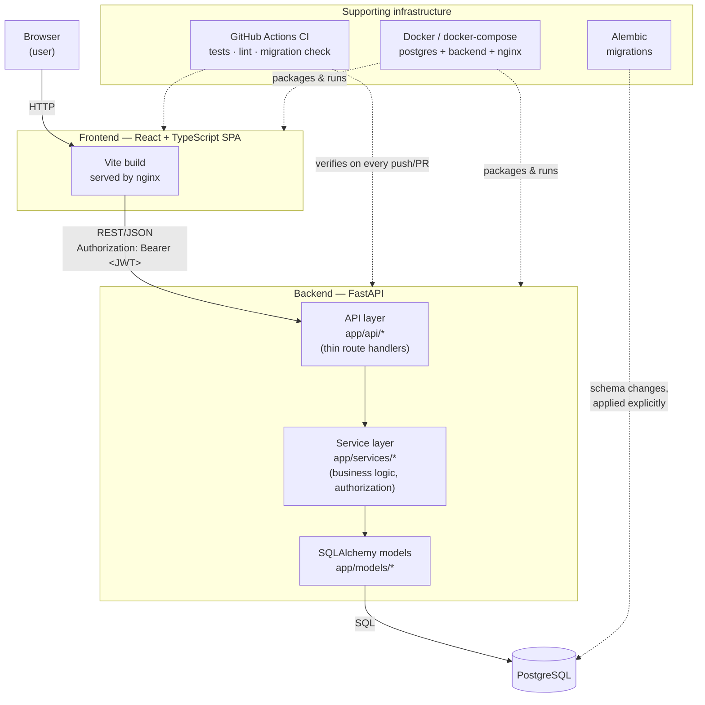
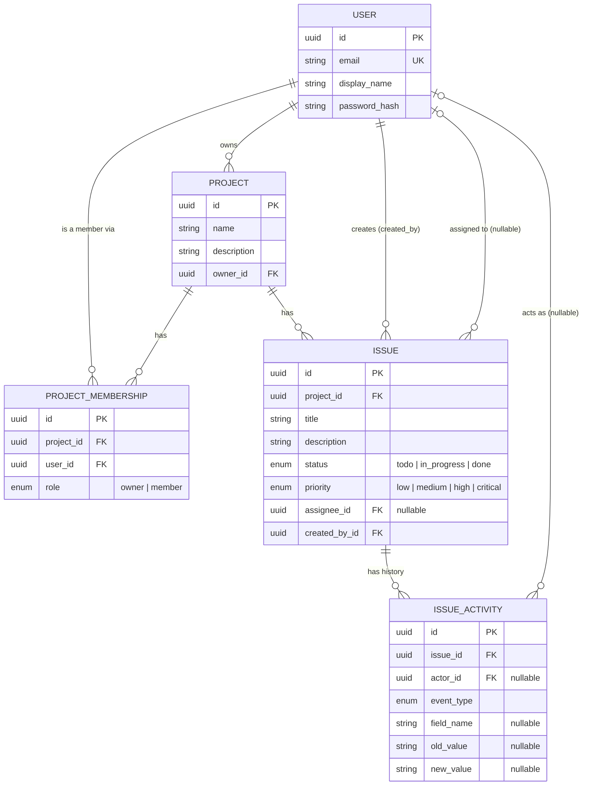
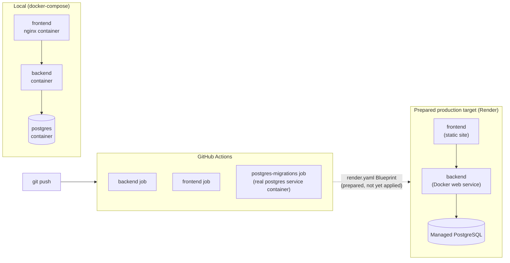

# Architecture

## System Overview

DevTrack is two independently deployable applications talking over a REST/JSON API — a React
SPA and a FastAPI backend backed by PostgreSQL. Nothing is shared between them except that
HTTP contract.



The backend is layered to keep concerns separated (see the root README for the directory
breakdown): route handlers in `app/api/` never touch the database directly — they call into
`app/services/`, which owns business logic and authorization decisions and is the only layer
that talks to SQLAlchemy models (`app/models/`). Pydantic schemas (`app/schemas/`) are a
distinct concept from ORM models, so what's stored and what's exposed over the API can evolve
independently (e.g. `password_hash` exists on the `User` model but no response schema ever
includes it).

## Authentication Flow

```mermaid
sequenceDiagram
    participant U as User
    participant F as Frontend
    participant A as Backend (/api/auth)
    participant D as PostgreSQL

    U->>F: Enter email + password
    F->>A: POST /api/auth/login
    A->>D: Look up user, verify Argon2 hash
    D-->>A: User row
    A-->>F: JWT access token
    F->>F: Store token in localStorage
    F->>A: Subsequent requests with<br/>Authorization: Bearer &lt;token&gt;
    A->>A: Decode + validate JWT,<br/>load current_user from sub claim
    A-->>F: Response (identity never<br/>taken from the request body)
```

Registration follows the same shape as login, minus the credential check: `POST
/api/auth/register` hashes the password with Argon2 (via `pwdlib`) before it ever touches the
database, and the response schema never includes `password_hash`. A JWT's `sub` claim holds the
user's id; every protected endpoint resolves `current_user` from that claim via a single shared
FastAPI dependency (`app/api/deps.py`) — no endpoint trusts a user id supplied in a request body
or query string for identity purposes.

## Authorization Model

Authorization is enforced in the service layer, not the frontend — the UI hides controls a user
can't use, but every rule is re-checked server-side regardless of what the client sends:

- **Project ownership**: only a project's owner can update it, delete it, or add/remove members.
- **Project membership**: only members can view a project's details, issues, or activity; only
  members can create/update/delete issues within it.
- **Identity derivation**: a project's `owner_id` and an issue's `created_by_id`/activity
  `actor_id` are always derived from the authenticated `current_user`, never accepted as
  client-supplied fields — the request schemas for creating a project or issue don't even have
  those fields.
- **Self-service**: a user can only update or delete their own account.

## Domain Model



A few deliberate choices worth calling out:

- **`(project_id, user_id)` is unique** on `PROJECT_MEMBERSHIP` — enforced at the database level
  with a unique constraint, not just in application code, so a user can't be added to the same
  project twice regardless of which code path tries it.
- **Foreign keys use explicit `ON DELETE` behavior**, chosen per relationship rather than left at
  a default: `Project.owner_id` is `RESTRICT` (a user who still owns a project can't be deleted —
  ownership never silently disappears), `Issue.assignee_id` is `SET NULL` (unassigning is a
  normal, harmless outcome of a user being removed), and child rows (`PROJECT_MEMBERSHIP`,
  `ISSUE`, `ISSUE_ACTIVITY`) `CASCADE` from their parent.
- **`ISSUE_ACTIVITY` is scoped to issues only** — it is deliberately not a general-purpose,
  app-wide audit log. Free-text fields (issue description) are recorded as "changed" without
  persisting the actual before/after content, to avoid storing large or sensitive free-form text
  in an append-only log.
- **Status and priority are enum columns with `native_enum=False` and an explicit
  `create_constraint=True`** (see `app/models/enums.py` and the model files), which renders as a
  portable `VARCHAR` + `CHECK` constraint on both SQLite (tests) and PostgreSQL (production),
  rather than a PostgreSQL-native `ENUM` type that would need `ALTER TYPE` migrations to extend
  later.

## Deployment Architecture



Migrations are never run automatically as part of backend startup or a deploy trigger — they're
a deliberate, separate step (`docker compose run --rm migrate` locally; the equivalent one-off
command against whichever database a real deployment uses). See the root README's "Migrations"
section for the full reasoning and exact commands, and [development.md](development.md) for the
day-to-day workflow.
